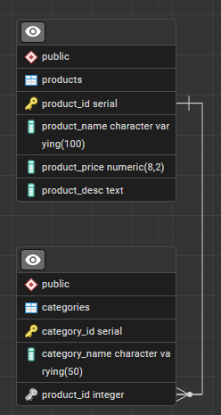

# Servlet Fullstack
## Author
[Braedyn (Violet) French](https://github.com/Pirategirl9000)

## Purpose
* This program uses a Tomcat container and servlets to create a fullstack application without a large framework.
* This program also uses a JDBC connection to a PostgreSQL database hosted locally

## Intent
* My intention with this program is to learn how the fullstack looks in Java without the usage of frameworks like Spring.
* The goal is to enhance my abilities at building web applications furthering my understanding of the underlying technologies

## Database
* This program uses PostgreSQL hosted locally on my machine for storing the data this program uses

